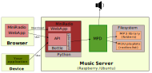

# Architecture


MiniRadio requires a functional and properly configured MPD server with access to your MP3 file library and your playlists.

It uses 2 pythons modules :
* API framework Bottle : https://bottlepy.org/docs/dev/
* Python client library for MPD : https://pypi.org/project/python-mpd2/

# Using Miniradio

## Installation
1. Create your MiniRadio folder
`mkdir <your path>/MiniRadio`

2. Copy MiniRadio application sources folder `miniradio_app` in created folder `<your path>/MiniRadio`

3. Create virtual environnement
```
python3 -m venv <your path>/MiniRadio/venv
source <your path>/MiniRadio/venv/bin/activate
```

4. Install dependences
```
pip install bottle
pip install python-mpd2
pip install gunicorn
```


5. Create launcher script `start_miniradio.sh` in `<your path>/MiniRadio`

6. Insert following code in `start_miniradio.sh`
```
#!/bin/bash
source $(dirname $(readlink -f $0))/venv/bin/activate
python3 $(dirname $(readlink -f $0))/miniradio_app/application.py
```

7. Save and make script executable : `chmod 755 start_miniradio.sh`

## Configuration
The configuration of MiniRadio is found in the file `radioui.conf`, which is by default located in the `configuration` directory of the application's sources.
Example :
```
[global]
run-mode = DEBUG
listening-host = 0.0.0.0
listening-port = 6809
listening-https-keyfile = 
listening-https-certfile =

[mpd.connexion]
mpd-address = localhost
mpd-port = 6600

[web.client]
use-web-client = True
```

* `run-mode` can have 2 values : `DEBUG` for maximum information in standard error output, or `NORMAL` for minimization of output. Default is `NORMAL`.
* `listening-host` : This is IP address for listening HTTP/HTTPS request (default : 0.0.0.0 ==> for listening on all IP interfaces of host).
* `listening-port` : This is port use by MiniRadio for listening HTTP requests (default : 6809)
* `listening-https-keyfile` : If you want the application to be secured by HTTPS, then enter the path to the file containing the private key in this option. By default, this option is empty, which causes the application to start without HTTPS.
* `listening-https-certfile` : If you want the application to be secured by HTTPS, then enter the path to the file containing the certificate in this option. By default, this option is empty, which causes the application to start without HTTPS.
* `mpd-address` : This is the adress (IP or domain name) where MPD listen. For connexion by socket on same host, you can put node name of abstract socket (ex : `/run/mpd/socket`). Default is 'localhost'.
* `mpd-port` : Port on which MPD listen. Default is 6600.
* `use-web-client` : Allow to activate web UI (value `True`) or inactivate it (value `False`). Default is `False`.

## Manual execution
Launch your script `start_miniradio.sh`.
Ctrl+C for stop execution.

## Execution at boot
1. Create empty service file `miniradio-webserver.service` in `/etc/systemd/system`

2. Insert flowing code in service file
```
[Unit]
Description=MiniRadio webserver

[Service]
Type=simple
ExecStart=<your path>/MiniRadio/start_miniradio.sh
Restart=on-failure
User=<your user>

[Install]
WantedBy=multi-user.target
```
Replace `<your path>` and `<your user>` with your installation path and your execution user (never use root).

3. Validate the unit file before loading it.
`sudo systemd-analyze verify /etc/systemd/system/miniradio-webserver.service`

4. Reload the service manager so it reads the new unit file.
`sudo systemctl daemon-reload`

5. Enable the service for future boots and start it in the current boot.
`sudo systemctl enable --now miniradio-webserver.service`

6. To check service
`sudo systemctl status miniradio-webserver.service`

## Access to MiniRadio

The homepage is accessible at the address `http://<your-server-address>:<listening-port>/`.

API is accessible at `http://<your-server-address>:<listening-port>/api/`.

Web UI is accessible at `http://<your-server-address:listening-port>/webclient/`.

Example : [http://localhost:6809/](http://localhost:6809/)

# HTTPS and PWA
This chapter is not required for non critical service in local network, but
- If you want the best integration on your device, you can install MiniRadio web client as PWA ([Progressive Web Application](https://en.wikipedia.org/wiki/Progressive_web_app)). It's allow to have an icon on you desktop (ex : Android) and not have browser toolbar. Using PWA required to activate HTTPS protocol.
- If you want to secure your MiniRadio site with HTTPS.

So how to install HTTPS in MiniRadio (inspired by this [site](https://deliciousbrains.com/ssl-certificate-authority-for-local-https-development/)).

## Certificate authority
Your web app needs to be installed with a certificate signed by a certification authority. If you already have one, you can skip this chapter.

You need to have OpenSSL on your computer.

1. Create your AC directory (you can choose another path)
```
mkdir ~/certs
cd ~/certs
```

2. Generate the private key to become a local CA
```
openssl genrsa -des3 -out myLocalCA.key 2048
```

3. Generate a root certificate
```
openssl req -x509 -new -nodes -key myLocalCA.key -sha256 -days 1825 -out myLocalCA.pem
```

The answers to those questions aren’t that important. But you must use "Common Name" that allow you to recongnize your root certificate in a list of other certificates.

It's all, you have your CA.

## Deploy your CA
You can deploy your CA in your system (ex : Chrome or Firefox) in your parameter "User Certificate Authority" depending of your system configuration.

## WebApp certificate
Now that you have a certification authority, we will create the certificate for the web app.

1. Create a private key for the dev site.
```
openssl genrsa -out <your_site_domain_name>.key 2048
```

Your key can have your site name. This is not required, but is much easier to find it in a list.

2. Create a certificate request (CSR)
```
openssl req -new -key <your_site_domain_name>.key -out <your_site_domaine_name>.csr
```

You'll get several questions. Your anwsers don’t matter, but good value help to manage certificate.

3. Create an X509 V3 certificate extension config file

Create file named `<your_site_domain_name>.ext` containing following text :
```
authorityKeyIdentifier=keyid,issuer
basicConstraints=CA:FALSE
keyUsage = digitalSignature, nonRepudiation, keyEncipherment, dataEncipherment
subjectAltName = @alt_names

[alt_names]
DNS.1 = <your_site_domain_name>
```

4. Create the certificate: using our CSR, the CA private key, the CA certificate, and the config file:
```
openssl x509 -req -in <your_site_domain_name>.csr -CA myLocalCA.pem -CAkey myLocalCA.key -CAcreateserial -out <your_site_domain_name>.crt -days 825 -sha256 -extfile <your_site_domain_name>.ext
```

5. Configure MiniRadio for using new certificate

Now, you have three files: `<your_site_domain_name>.key` (the private key), `<your_site_domain_name>.csr` (the certificate signing request, or csr file), and `<your_site_domain_name>.crt` (the signed certificate).

You can edit your 'radioui.conf' to modify the 2 following values :
```
listening-https-keyfile = ~/certs/<your_site_domain_name>.key
listening-https-certfile = ~/certs/<your_site_domain_name>.crt
```

You can adjust these values with your specifics directories and file name.